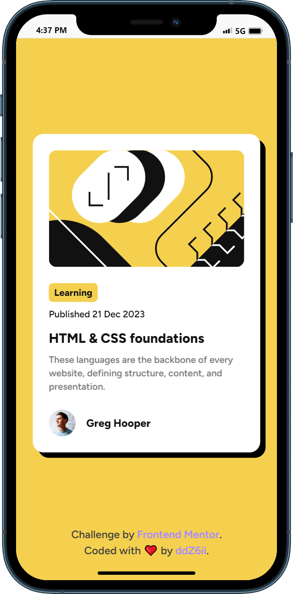
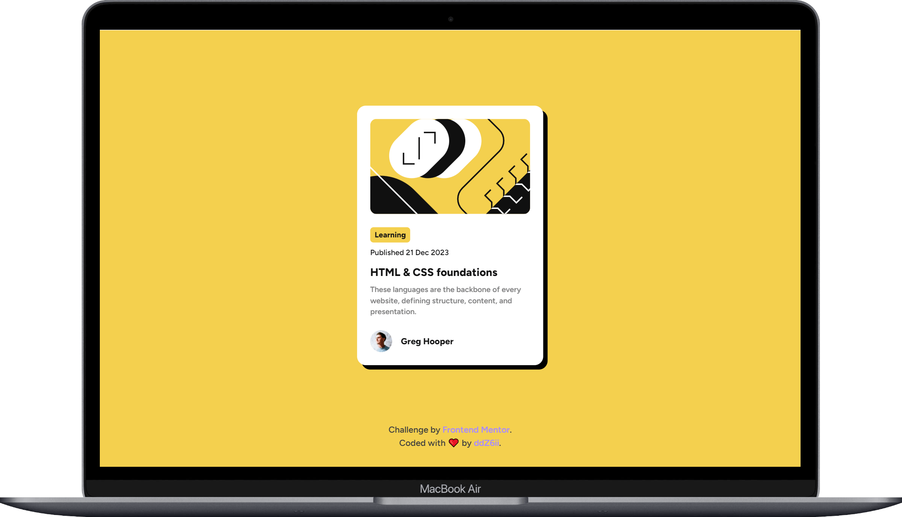

# Frontend Mentor - Blog preview card solution

This is a solution to the [Blog preview card challenge on Frontend Mentor](https://www.frontendmentor.io/challenges/blog-preview-card-ckPaj01IcS). Frontend Mentor challenges help you improve your coding skills by building realistic projects. 

## Table of contents

- [Overview](#overview)
  - [The challenge](#the-challenge)
  - [Screenshots](#screenshots)
  - [Links](#links)
- [Getting started](#getting-started)
- [My process](#my-process)
  - [Built with](#built-with)
  - [Deployed with](#deployed-with)
  - [What I learned](#what-i-learned)
  - [Useful resources](#useful-resources)
- [Author](#author)


## Overview

### The challenge

Users should be able to:

- See hover and focus states for all interactive elements on the page

### Screenshot

- Phone:
  

- Desktop:
  

### Links

- Solution URL: [frontend-mentor-solution](https://www.frontendmentor.io/solutions/responsive-card-with-interactive-elements--VyBb-nheP)
- Live Site URL: [blog-preview-card](https://blog-preview-card-ochre-chi.vercel.app/)

## Getting started

Clone the project and run the following command:

```console
yarn install
```

This will initialize the project by installing all the required dependencies.

## My process

### Built with


- Semantic HTML5 markup
- Tailwind CSS
- Flexbox
- CSS Grid
- Parcel bundler
- Mobile-first workflow

### Deployed with


### What I learned

How to style a parent when hovering one of it descendent in Tailwind 🚀

```html
    <article
      class="shadow-base [&:has(a:hover)]:shadow-thicker transition-all"
    >
    <!-- ... -->
      <div>
        <h2 class="mb-2 text-xl font-bold">
          <a
            href="#"
            class="hover:text-primary outline-primary inline-block w-full"
            >HTML & CSS foundations</a
          >
        </h2>
      </div>
    <!-- ... -->

    </article>
```

### Useful resources

- [Github discussions](https://github.com/tailwindlabs/tailwindcss/discussions/10206) - A big up 👍 to *martinszeltins* and *wongjn*

## Author

- Github - [@ddZ6ii](https://github.com/ddZ6ii)
- Frontend Mentor - [@ddZ6ii](https://www.frontendmentor.io/profile/ddZ6ii)
- Linkedin - [@denis-dezest](https://www.linkedin.com/in/denis-dezest/)
